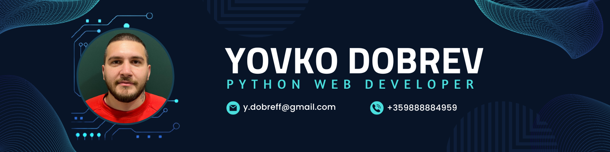

  <h1>Hello, I'm Yovko Dobrev 👋</h1>

Welcome to my GitHub profile! I'm a Student passionate about learning Programming, Computer Networking, System Administration, Blockchain Development, Cybersecurity and Ethical Hacking.

## 🔧 Technologies & Tools
- Languages:

- Frameworks: 
- Tools:
</a>
</a>
  

- Databases:  

## 🌱 I’m currently learning

## 💬 Connect with me:

 

<h1 align="center">  
Feel free to reach out to me! I'm always open to interesting conversations and collaboration.

</h1>
